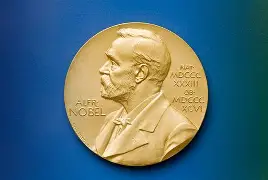

# Visualizing the History of Nobel Prize Winners

All of my workings can be found here: [Data analysis](nobel_prize.ipynb)

The Nobel Foundation has made a dataset available of all prize winners from the outset of the awards from 1901 to 2023. The dataset used in this project is from the Nobel Prize API and is available in the `nobel.csv` file in the `data` folder.

## Required Packages

- **pandas** (>=1.3.0) - Data manipulation and analysis
- **seaborn** (>=0.11.0) - Statistical data visualization
- **numpy** (>=1.20.0) - Numerical computing
- **matplotlib** (>=3.4.0) - 2D plotting library
- **jupyter** (>=1.0.0) - Interactive computing environment
- **ipython** (>=7.0.0) - Interactive Python shell

## Dataset Information

The `nobel.csv` dataset contains the following columns:
- `prize_year` - Year the Nobel Prize was awarded
- `category` - Prize category (Physics, Chemistry, Medicine, Literature, Peace, Economics)
- `full_name` - Name of the laureate
- `gender` - Gender of the laureate
- `birth_country` - Country of birth
- And additional fields with biographical information

## Analysis Highlights

The analysis answers the following questions:

1. **Gender Distribution**: Which gender has won more Nobel Prizes?
2. **Most Awarded Country**: Which country has produced the most Nobel Prize winners?
3. **US Dominance by Decade**: In which decade did the US have the highest proportion of Nobel laureates?
4. **Female Laureates by Category**: Which decade-category combination had the highest proportion of female winners?
5. **First Woman Laureate**: Who was the first woman to win a Nobel Prize and in which category?
6. **Multiple Prize Winners**: Which individuals or organizations have won multiple Nobel Prizes?

## Notes

- All visualizations are saved as PNG files in the `models/` folder
- The analysis uses pandas groupby operations and matplotlib/seaborn for visualization
- Missing values in the dataset are filled with 0 for easier processing

